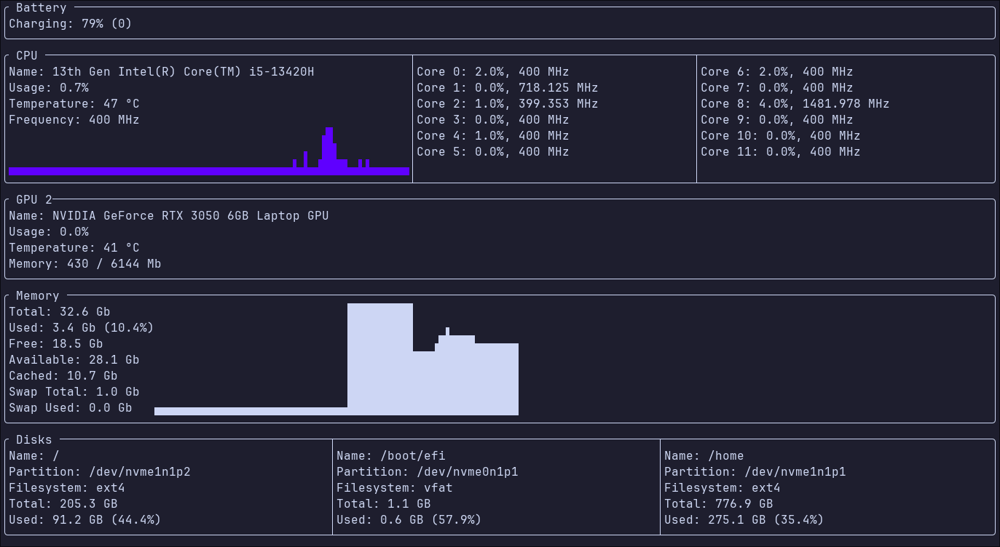
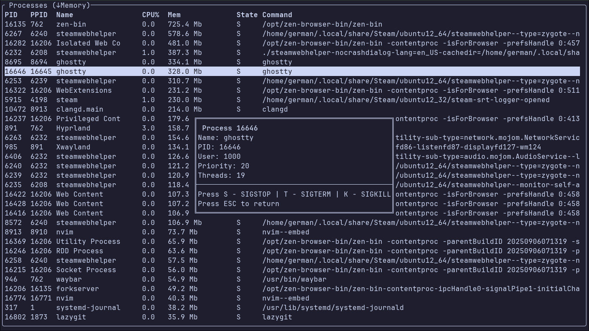

# mytop

`mytop` — это терминальный системный монитор, аналог `top`/`htop`, написанный на C++ с использованием [FTXUI](https://github.com/ArthurSonzogni/FTXUI) и [fmt](https://github.com/fmtlib/fmt).  
Он отображает информацию о процессах и состоянии системы в реальном времени в удобном интерфейсе.






## ✨ Возможности

- 📊 Мониторинг загрузки **CPU**
- 🖥️ Использование **оперативной памяти**
- 💾 Статистика по **дискам**
- 🔋 Информация о **батарее**
- 🎮 Мониторинг **GPU**
- ⚙️ Список **процессов**
- 🌐 Базовые данные о **системе**


## 📦 Установка и сборка

### Требования

- C++20
- CMake (>= 3.14)
- Make
- FTXUI
- fmt
- NVIDIA Management Library (`nvidia-ml`) для мониторинга GPU (по необходимости)

### Сборка через Makefile

```bash
git clone https://github.com/WunderwaffleX/mytop.git
cd mytop

make run
```

## 📂 Структура проекта

```
mytop
├── include/        
├── src/            
│   ├── providers/  
├── build/          
├── Makefile        
├── CMakeLists.txt  
└── mytop           
```
